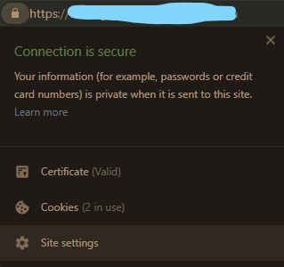
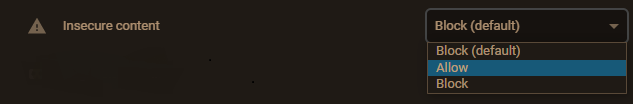

## The Api was provided HTTP but the free hosting site only provides HTTPS domain, So the app won't Run in Live server due to Mixed Content Error.

## Must Follow this Procedure to Run the Live Server

## Available Scripts

To start the Project

### `npm install`

### `npm start`

